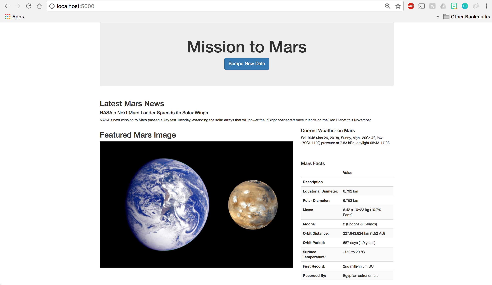

# Mission to Mars (General Scraping Code)



```python
# coding: utf-8
# Dependencies
from bs4 import BeautifulSoup as bs
import pandas as pd
import requests
from splinter import Browser
executable_path = {"executable_path": "/usr/local/bin/chromedriver"}
browser = Browser("chrome", **executable_path, headless=False)
```

## NASA Mars News


```python
# Visit the NASA Mars News Site
url = "https://mars.nasa.gov/news/"
browser.visit(url)
```


```python
# Scrape the page into soup
html = browser.html
soup = bs(html, "html.parser")
```


```python
# Collect the latest News Title
find_news_title = soup.find("div", class_="content_title")
news_title = find_news_title.a.text
news_title
```


    "NASA's Next Mars Lander Spreads its Solar Wings"


```python
# Collect the latest News Paragraph Text
find_news_paragraph = soup.find("div", class_="article_teaser_body")
news_p = find_news_paragraph.text
news_p
```


    "NASA's next mission to Mars passed a key test Tuesday, extending the solar arrays that will power the InSight spacecraft once it lands on the Red Planet this November."


## JPL Mars Space Images - Featured Image


```python
# Visit the NASA JPL site 
url2 = "https://www.jpl.nasa.gov/spaceimages/?search=&category=Mars"
browser.visit(url2)
```


```python
# Navigate the site to find the full .jpg URL
browser.find_by_css("a#full_image.button.fancybox").click()
```


```python
browser.find_by_css("div.buttons a.button").click()
```


```python
browser.find_by_css("img.main_image").click()
```


```python
# Scrape the page into soup
html2 = browser.html
soup2 = bs(html2, "html.parser")
```


```python
# Find the image URL for the current Featured Mars Image
find_featured_image = soup2.find("img", class_="shrinkToFit")
featured_image_url = find_featured_image["src"]
featured_image_url
```


    'https://www.jpl.nasa.gov/spaceimages/images/largesize/PIA17462_hires.jpg'


## Mars Weather


```python
# Visit the Mars Weather Twitter account 
url3 = "https://twitter.com/marswxreport?lang=en"
browser.visit(url3)
```


```python
# Scrape the page into soup
html3 = browser.html
soup3 = bs(html3, "html.parser")
```


```python
# Find the tweet text for the weather report
find_mars_weather = soup3.find("p", class_="TweetTextSize TweetTextSize--normal js-tweet-text tweet-text")
mars_weather = find_mars_weather.text
mars_weather
```


    'Sol 1941 (Jan 21, 2018), Sunny, high -20C/-4F, low -77C/-106F, pressure at 7.58 hPa, daylight 05:44-17:29'


## Mars Facts


```python
# Visit the Mars Facts webpage
url4 = "https://space-facts.com/mars/"
browser.visit(url4)
```


```python
# Use Pandas to scrape the table containing facts about the planet
mars_facts_table = pd.read_html(url4)
mars_facts_table[0]
```


<div>
<table border="1" class="dataframe">
  <thead>
    <tr style="text-align: right;">
      <th></th>
      <th>0</th>
      <th>1</th>
    </tr>
  </thead>
  <tbody>
    <tr>
      <th>0</th>
      <td>Equatorial Diameter:</td>
      <td>6,792 km</td>
    </tr>
    <tr>
      <th>1</th>
      <td>Polar Diameter:</td>
      <td>6,752 km</td>
    </tr>
    <tr>
      <th>2</th>
      <td>Mass:</td>
      <td>6.42 x 10^23 kg (10.7% Earth)</td>
    </tr>
    <tr>
      <th>3</th>
      <td>Moons:</td>
      <td>2 (Phobos &amp; Deimos)</td>
    </tr>
    <tr>
      <th>4</th>
      <td>Orbit Distance:</td>
      <td>227,943,824 km (1.52 AU)</td>
    </tr>
    <tr>
      <th>5</th>
      <td>Orbit Period:</td>
      <td>687 days (1.9 years)</td>
    </tr>
    <tr>
      <th>6</th>
      <td>Surface Temperature:</td>
      <td>-153 to 20 °C</td>
    </tr>
    <tr>
      <th>7</th>
      <td>First Record:</td>
      <td>2nd millennium BC</td>
    </tr>
    <tr>
      <th>8</th>
      <td>Recorded By:</td>
      <td>Egyptian astronomers</td>
    </tr>
  </tbody>
</table>
</div>


```python
# Data cleanup
mars_facts = mars_facts_table[0]
mars_facts.columns = ["Description", "Value"]
mars_facts.set_index("Description", inplace=True)
mars_facts
```


<div>
<table border="1" class="dataframe">
  <thead>
    <tr style="text-align: right;">
      <th></th>
      <th>Value</th>
    </tr>
    <tr>
      <th>Description</th>
      <th></th>
    </tr>
  </thead>
  <tbody>
    <tr>
      <th>Equatorial Diameter:</th>
      <td>6,792 km</td>
    </tr>
    <tr>
      <th>Polar Diameter:</th>
      <td>6,752 km</td>
    </tr>
    <tr>
      <th>Mass:</th>
      <td>6.42 x 10^23 kg (10.7% Earth)</td>
    </tr>
    <tr>
      <th>Moons:</th>
      <td>2 (Phobos &amp; Deimos)</td>
    </tr>
    <tr>
      <th>Orbit Distance:</th>
      <td>227,943,824 km (1.52 AU)</td>
    </tr>
    <tr>
      <th>Orbit Period:</th>
      <td>687 days (1.9 years)</td>
    </tr>
    <tr>
      <th>Surface Temperature:</th>
      <td>-153 to 20 °C</td>
    </tr>
    <tr>
      <th>First Record:</th>
      <td>2nd millennium BC</td>
    </tr>
    <tr>
      <th>Recorded By:</th>
      <td>Egyptian astronomers</td>
    </tr>
  </tbody>
</table>
</div>


```python
# Use Pandas to convert the data to a HTML table string
mars_facts_html = mars_facts.to_html()
mars_facts_html = mars_facts_html.replace('\n', '')
mars_facts_html
```


    '<table border="1" class="dataframe">  <thead>    <tr style="text-align: right;">      <th></th>      <th>Value</th>    </tr>    <tr>      <th>Description</th>      <th></th>    </tr>  </thead>  <tbody>    <tr>      <th>Equatorial Diameter:</th>      <td>6,792 km</td>    </tr>    <tr>      <th>Polar Diameter:</th>      <td>6,752 km</td>    </tr>    <tr>      <th>Mass:</th>      <td>6.42 x 10^23 kg (10.7% Earth)</td>    </tr>    <tr>      <th>Moons:</th>      <td>2 (Phobos &amp; Deimos)</td>    </tr>    <tr>      <th>Orbit Distance:</th>      <td>227,943,824 km (1.52 AU)</td>    </tr>    <tr>      <th>Orbit Period:</th>      <td>687 days (1.9 years)</td>    </tr>    <tr>      <th>Surface Temperature:</th>      <td>-153 to 20 °C</td>    </tr>    <tr>      <th>First Record:</th>      <td>2nd millennium BC</td>    </tr>    <tr>      <th>Recorded By:</th>      <td>Egyptian astronomers</td>    </tr>  </tbody></table>'


